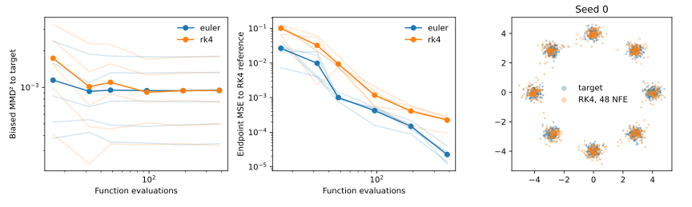

# Flow Matching — Independent Reproduction

A PyTorch implementation of conditional Flow Matching, with controlled studies of
probability paths and ODE integration on an eight-Gaussians target.

The experiment asks a specific question: **does a higher-order solver produce better
samples when both solvers have the same number of vector-field evaluations?**

## Results

Five seeds, 2,000 training updates per seed, 1,000 evaluation samples, paired noise
and targets, and a shared target-only RBF bandwidth:

| Solver, 48 NFE | Mean MMD² |
|---|---:|
| Euler, 48 steps | 0.00094724 |
| RK4, 12 steps | 0.00109940 |

The paired RK4-minus-Euler difference is +0.00015216; its seed-bootstrap 95% interval
is [+0.00000403, +0.00031817]. Lower is better. The result favors Euler in this small
synthetic study. The linear/trigonometric path comparison is inconclusive.

An additional **six-budget NFE sweep** separates distributional MMD² from numerical
endpoint error against an 8,192-NFE RK4 reference. Doubling that reference budget
checks its convergence. Numerical error falls with budget while MMD² largely plateaus.



[Full results and interpretation](docs/RESULTS.md) ·
[Raw per-seed measurements](results/published/nfe_sweep.json) ·
[Method and design choices](docs/METHOD.md)

## Reproduce

Python 3.10+; CPU is sufficient. From the repository root:

```bash
python -m pip install -e ".[dev,plots]"
OMP_NUM_THREADS=1 MKL_NUM_THREADS=1 python scripts/run_multiseed_solver_study.py --nfe 48
OMP_NUM_THREADS=1 MKL_NUM_THREADS=1 python scripts/run_nfe_sweep.py --reference-nfe 8192
python -m pytest -q
```

The sweep trains one field per seed and evaluates both solvers at 16, 32, 48, 96,
192 and 384 NFE. JSON includes per-seed metrics, model-state hashes, runtime versions,
reference convergence checks and integration timings. Timings depend on hardware.

For the measured local stack, see [requirements-reproduce.txt](requirements-reproduce.txt)
(Python 3.12; critical package pins).

## Code

- [paths.py](src/flow_matching/paths.py): conditional interpolants and their velocities.
- [models.py](src/flow_matching/models.py): time-conditioned neural vector field.
- [training.py](src/flow_matching/training.py): conditional velocity regression with AdamW.
- [solvers.py](src/flow_matching/solvers.py): Euler and classical RK4 on [0, 1].
- [tests/test_solvers.py](tests/test_solvers.py): analytic convergence and actual function-call counts.

This reproduces the core mechanism, not the original paper's image-generation
benchmarks. There is no publication or high-dimensional performance claim.

## References

- Lipman et al., [Flow Matching for Generative Modeling](https://arxiv.org/abs/2210.02747), ICLR 2023.
- [Meta Flow Matching](https://github.com/facebookresearch/flow_matching), including its 2-D example.
