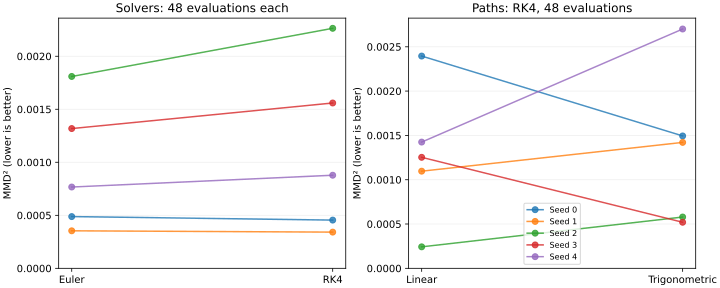

# Controlled 2-D flow-matching experiments

## Scope and protocol

These are independent synthetic experiments with the core conditional flow-matching
objective, not a reproduction of the original paper's image-generation benchmarks.
Each model uses 2,000 training steps, a batch of 512, AdamW at 0.002, and seeds 0–4.
Each evaluation compares 1,000 generated samples against 1,000 target samples from
eight Gaussians. Methods within each seed share base noise and target samples.
The biased RBF MMD² uses the median positive squared distance in the target sample
as its bandwidth parameter, fixed across the methods being compared.

## Equal-budget solver study

Both solvers use exactly 48 vector-field evaluations: Euler has 48 steps; RK4 has 12.
Both use the same trained linear-path model within each seed.

| Solver | Mean MMD² | Sample standard deviation |
|---|---:|---:|
| Euler | 0.00094724 | 0.00060761 |
| RK4 | 0.00109940 | 0.00080713 |

The paired mean RK4 minus Euler is +0.00015216. Its seed-bootstrap 95% interval is
[+0.00000403, +0.00031817]. This small study favors Euler under this metric and budget;
five seeds provide limited evidence, and higher integration order does not guarantee
better samples from an approximate learned vector field. No general solver claim follows.

## Probability-path study

Both paths have identical initialization and training budgets within each seed.
Generation uses RK4 with 48 evaluations. The trigonometric path is a controlled
alternative, not a claim to reproduce every diffusion path in the paper.

| Path | Mean MMD² | Sample standard deviation |
|---|---:|---:|
| Linear | 0.00128229 | 0.00077063 |
| Trigonometric | 0.00134284 | 0.00088508 |

The paired trigonometric minus linear difference is +0.00006056, with a 95% seed-bootstrap
interval of [-0.00062013, +0.00070984]. The direction changes across seeds; neither path
has an established advantage here. This study uses a different evaluation seed offset
from the solver study, so compare methods within each study, not across the two tables.



## NFE sweep: numerical accuracy versus sample quality

The same five trained fields are evaluated at six matched budgets. Endpoint MSE is
computed against RK4 at 8,192 NFE, with identical initial samples. Doubling the
reference to 16,384 NFE changes endpoint MSE by at most 1.44e-9 across the five seeds,
well below the sweep errors. This checks reference convergence for these fields.

| NFE | Euler MMD² | RK4 MMD² | Euler endpoint MSE | RK4 endpoint MSE |
|---|---:|---:|---:|---:|
| 16 | 0.0011448 | 0.0017367 | 0.0265739 | 0.1007161 |
| 32 | 0.0009265 | 0.0010113 | 0.0098237 | 0.0321661 |
| 48 | 0.0009472 | 0.0010994 | 0.0010024 | 0.0093231 |
| 96 | 0.0009385 | 0.0009112 | 0.0004192 | 0.0011714 |
| 192 | 0.0009393 | 0.0009381 | 0.0001480 | 0.0004108 |
| 384 | 0.0009449 | 0.0009405 | 0.0000226 | 0.0002233 |

Integration error generally decreases with compute, while MMD² reaches roughly
0.00094 and is not monotone in NFE. Higher numerical accuracy solves the learned
ODE more accurately; it does not remove learned-distribution or finite-sample error.
RK4's formal order on smooth fields does not guarantee a low-budget advantage here.
The time embedding spans up to 1,000 cycles on [0,1], which motivates a future
frequency-range ablation rather than attributing the observed ranking to solver
order alone. No frequency ablation has been run.


Raw values, timings and trained-state hashes are in
`results/published/nfe_sweep.json`. The analytic exponential-field test independently
checks Euler/RK4 convergence rates and counts actual field evaluations.

## Reproduce

From the repository root:

```bash
pip install -e ".[dev,plots]"
OMP_NUM_THREADS=1 MKL_NUM_THREADS=1 python scripts/run_multiseed_solver_study.py --nfe 48 --output results/published/solver_exact_nfe48.json
OMP_NUM_THREADS=1 MKL_NUM_THREADS=1 python scripts/run_path_ablation.py --output results/published/path_ablation_multiseed.json
OMP_NUM_THREADS=1 MKL_NUM_THREADS=1 python scripts/run_nfe_sweep.py --reference-nfe 8192 --output results/published/nfe_sweep.json
python scripts/plot_studies.py
pytest -q
```

Raw results and runtime versions are in `results/published/`. The earlier
`eight_gaussians_solver_multiseed.json` is preserved from GitHub Actions run
[37564755938](https://github.com/RyanBalech/Flow-Matching-Reproduction/actions/runs/37564755938)
at commit `1a3b4f6a20cf77e5665bbd1ed1192daf3beb969d`. It used Euler 50 versus RK4 48
evaluations and separately estimated bandwidths. Its apparent RK4 advantage is
superseded by the controlled comparison above; the old artifact is retained for audit.

Next research steps: more seeds, more target distributions, a predeclared bandwidth
sensitivity sweep, and time-embedding frequency ablations. These results are a project report,
not a peer-reviewed publication or evidence of high-dimensional performance.
